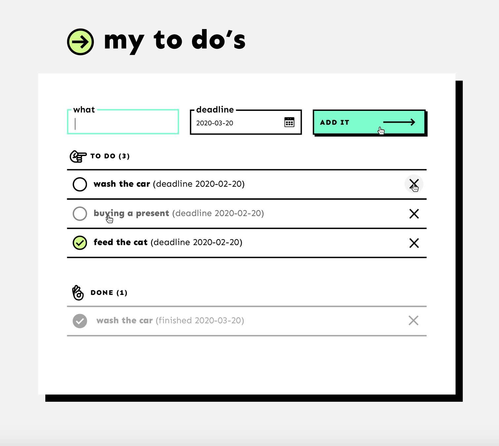

# my to do’s

A simple to-do app with a retro vibe. Very handy for making quick notes.

App was created with `create-react-app`

## Take a look at [this] app (https://jdzianok.github.io/my_to_do-s/)

## Preview

## The application offers basic functionalities

- adding new tasks
- displaying list of tasks divided into active and done
- sorting by date
- deleting active and done tasks

## Available Scripts

In the project directory, you can run:

### `npm start`

Runs the app in the development mode. 
Open [http://localhost:3000](http://localhost:3000) to view it in the browser.

The page will reload if you make edits. 
You will also see any lint errors in the console.

### `npm test`

Launches the test runner in the interactive watch mode. 
See the section about [running tests](https://facebook.github.io/create-react-app/docs/running-tests) for more information.

### `npm run build`

Builds the app for production to the `build` folder. 
It correctly bundles React in production mode and optimizes the build for the best performance.
